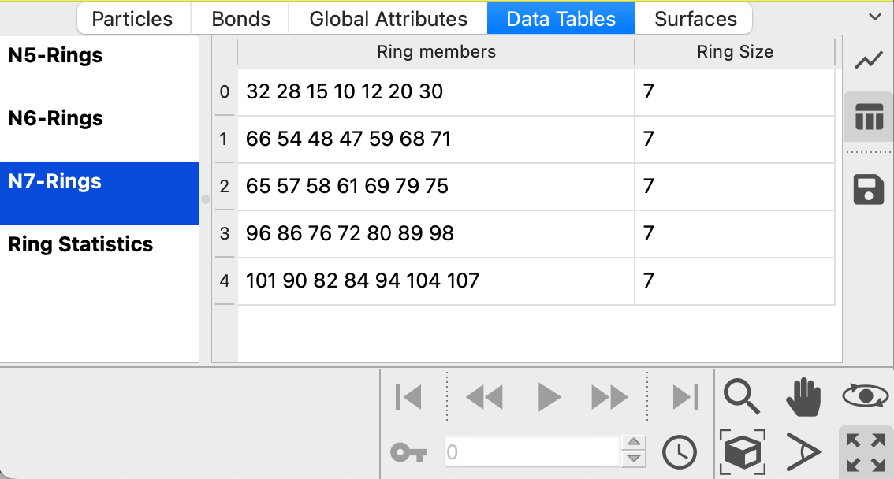
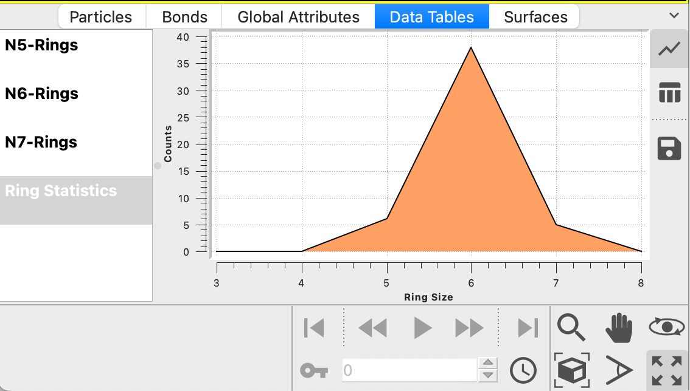

# Find Bond Rings Modifier
A Python-based modifier funtion for OVITO Pro that tries to find rings of specified sizes in the bond topology.

## Description

Uses the python package [networkx](https://networkx.org) to build directed search trees from OVITO's bond topoloy and to find simple cycles therein.

## Parameters 

- `Search for ring sizes up to:` The maximum ring size the modifier will search for.
- `Do not show rings smaller than:` Exclude results for rings smaller than specified value.
- `Create color mesh`: Wheter to create a surface mesh with the found rings as faces, which can be colored in subsequent steps. 

# Returns:
- `GlobalAttribute`
For each ring size a global attribute `N<X>-Ring count` will be stored indicating the total number of rings of that size in the current animation frame.

- `ParticleProperty`
Each particle gets assigned a property `N<X> Ring`, where `X`is in the minimum and maximum ring size range specified by the user. A value of 1 means the current particle is part of a ring of size `X`. Particles can be members of several rings.

- `BondProperty`
Each bond gets assigned a property `N<X> Ring`, where `X`is in the minimum and maximum ring size range specified by the user. A value of 1 means the current bond is part of a ring of size `X`. Bonds can be members of several rings.

- `DataTables`
| Data Table for each ring size in the specified range to look up the particle indices of the members of each ring. | A Histogram of the ring sizes found. | 
|:-------:|:-------:|
|  |


## Example
| Color Surface Mesh Faces  | Color Bonds and Particles |    | 
|:-------:|:-------:|:--------:|
|  ||
| |            |

## Installation
- OVITO Pro [integrated Python interpreter](https://docs.ovito.org/python/introduction/installation.html#ovito-pro-integrated-interpreter):
  ```
  ovitos -m pip install --user git+https://github.com/ckalcher/RingFinderModifier.git
  ``` 
  The `--user` option is recommended and [installs the package in the user's site directory](https://pip.pypa.io/en/stable/user_guide/#user-installs).

- Other Python interpreters or Conda environments:
  ```
  pip install git+https://github.com/ckalcher/RingFinderModifier.git
  ```

## Technical information / dependencies
- Tested on OVITO version 3.9.1

## Contact
Constanze Kalcher support@ovito.org
